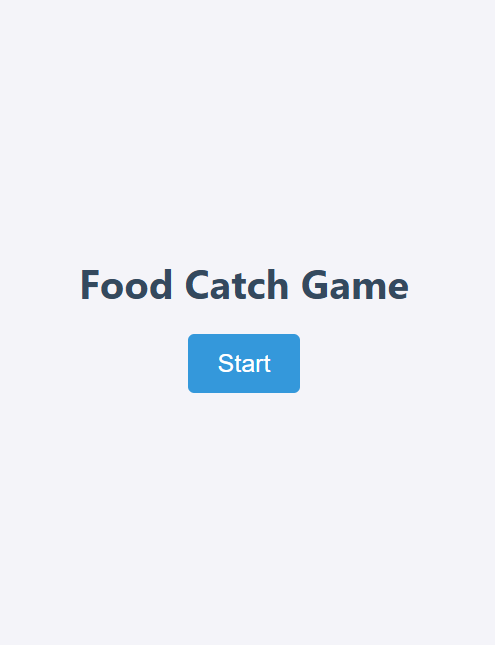
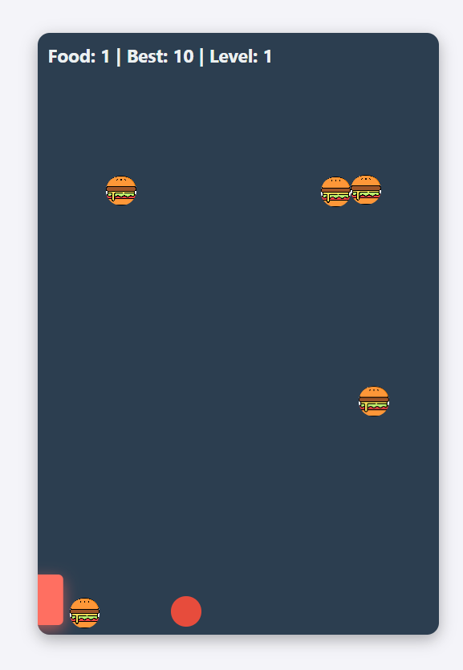
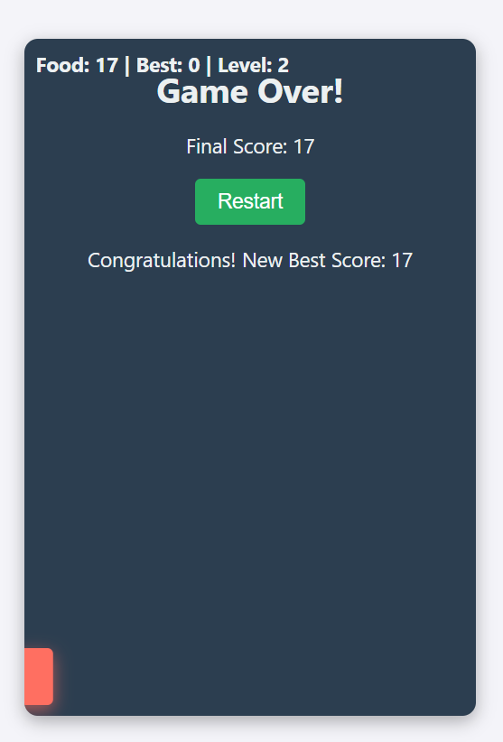

# 🍎 Food Dorger Game

A simple browser game where you catch falling food and avoid bombs. Built with **HTML, CSS & JavaScript**.

---

## 🎮 How to Play
- Move the player **left/right** using **mouse** or **touch**.  
- Catch **food** to score points.  
- Avoid **bombs** – collision ends the game.  
- Score and **level** increase as you play.

---

## 🚀 Features
- Start & restart screen  
- Scoreboard: current, best score & level  
- Smooth falling animations for food & bombs  
- Level progression & sound effects  

---

## 📸 Screenshots
**Start Screen:**  
  
**Game Interface:**  
  
**Game Over:**  
  

---

## 🛠️ Tech Stack
- **HTML5** – structure  
- **CSS3** – styling & animations  
- **JavaScript** – game logic  

---

## ⚙️ How to Run
1. Clone or download repo  
2. Ensure `assets/` folder has images and sounds (`food1.png…`, `Bomb.png`, `eat.mp3`, `blast.mp3`, `levelpass.mp3`)  
3. Open `index.html` in a browser and click **Start**

---

Made with ❤️ using **HTML, CSS, JS**.
